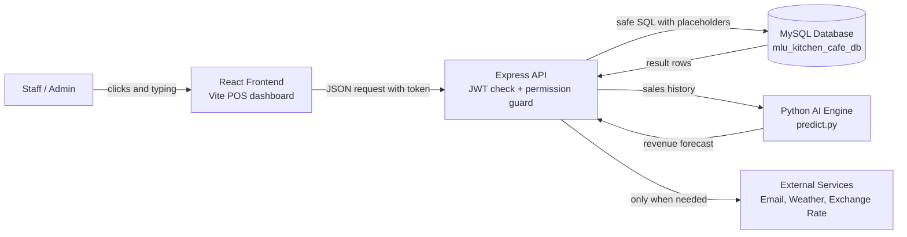
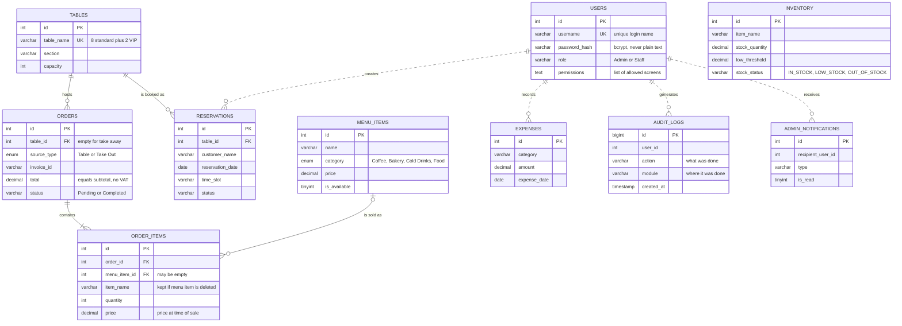
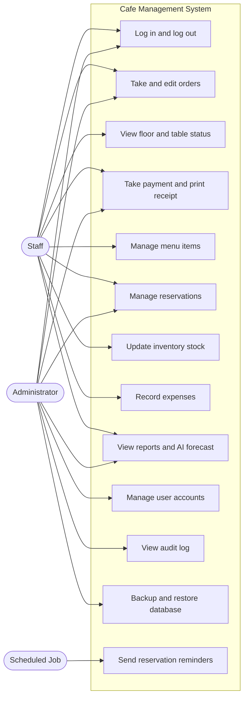
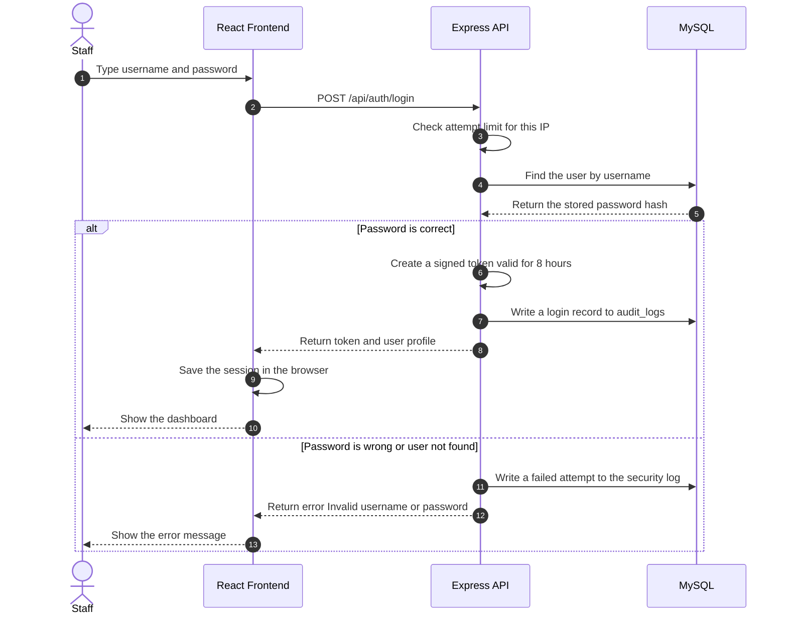
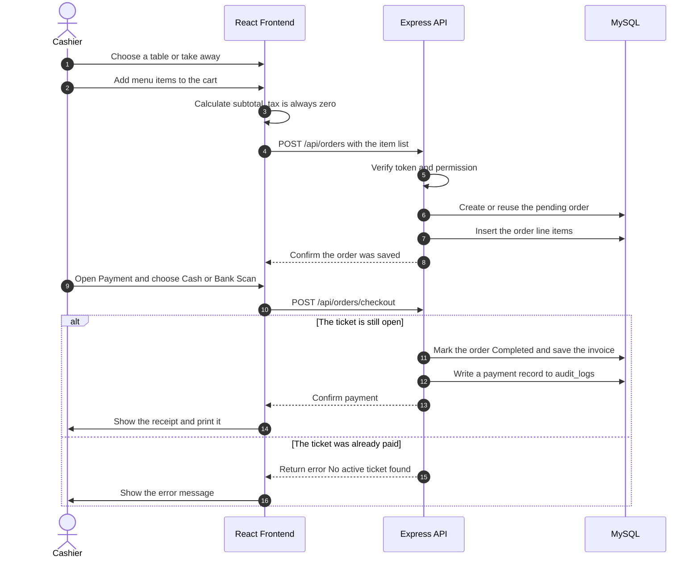
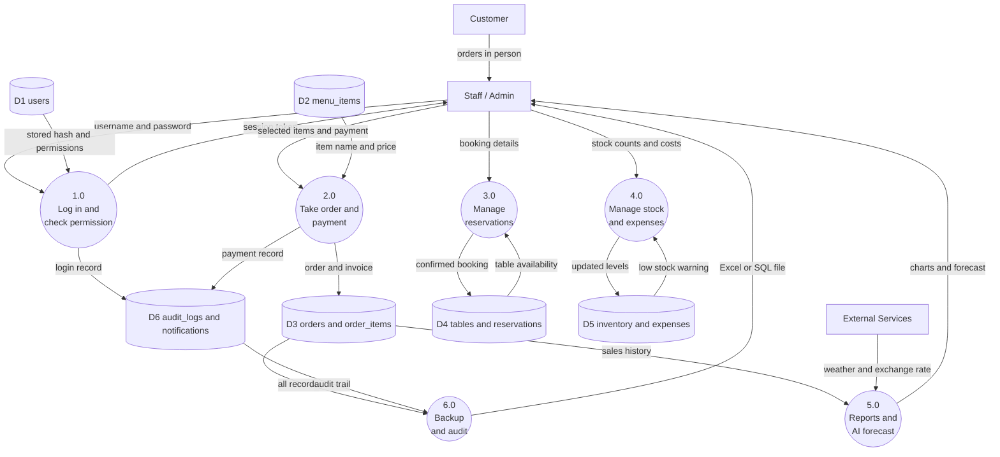

# System Architecture and Design Diagrams

**System:** Mlu Kitchen & Cafe Siem Reap — Point-of-Sale and Management System
**Database:** `mlu_kitchen_cafe_db` (MySQL 8.4.3)

## How to use these files

| File | What it is | How to open it |
| --- | --- | --- |
| `THESIS_DIAGRAMS.drawio` | **The actual pictures.** All six diagrams, already drawn and laid out on six tabs. | Go to [app.diagrams.net](https://app.diagrams.net) (free, no account needed) → **File → Open From → Device** → pick the file. |
| `THESIS_DIAGRAMS.md` | This file. The same information written as **tables and sentences** so you can read it without rendering anything, plus the Mermaid source. | Any text editor. |

**To get an image for your book:** open the `.drawio` file, choose the tab you want at the bottom,
then **File → Export as → PNG** (or SVG for sharper printing). Tick *Selection Only* off and
*Transparent Background* off.

Everything below is stated in plain sentences you can read aloud during your defence.

---

## Diagram 1 — System Architecture

*(draw.io tab: **1. System Architecture**)*

**What it shows:** the five parts of the system and the direction data travels between them.

### The parts

| # | Component | Technology | What it does |
| --- | --- | --- | --- |
| 1 | Staff / Admin | — | The only people who use the system. |
| 2 | React Frontend | React 19 + Vite | The screens in the browser. Holds no data of its own. |
| 3 | Express API | Node.js + Express 5 | Checks the login token and permission, then runs the business rules. |
| 4 | MySQL Database | MySQL 8.4.3 | Stores everything permanently. |
| 5 | Python AI Engine | Python + scikit-learn | Predicts future revenue from past sales. |
| 6 | External Services | Email, Weather, Exchange Rate | Optional extras. The system still works without them. |

### The connections

| From | To | What travels | When |
| --- | --- | --- | --- |
| Staff | React Frontend | Clicks and typing | Always |
| React Frontend | Express API | JSON request with login token | Every action |
| Express API | MySQL | SQL with placeholders | Every action |
| MySQL | Express API | Result rows | Every action |
| Express API | Python AI | Sales history | Only on the forecast screen |
| Python AI | Express API | Revenue forecast | Only on the forecast screen |
| Express API | External Services | Email, weather, exchange rate | Password resets and forecasts only |

### How to explain it

1. Staff work only in the browser. The frontend never touches the database directly.
2. Every action becomes a JSON request to the Express API, carrying a login token in the header.
3. The API checks the token and the user's permission before it does anything.
4. The API is the only component allowed to talk to MySQL, and it always uses placeholder queries so
   user input can never be executed as SQL.
5. For the forecasting screen, the API sends sales history to a Python script and gets a prediction
   back.
6. External services are contacted only for password resets and the AI screen.

Mermaid source

---

## Diagram 2 — Entity Relationship Diagram

*(draw.io tab: **2. Entity Relationship Diagram**)*

**What it shows:** the ten database tables and how they connect.

### The ten tables

| # | Table | What it stores | Key columns |
| --- | --- | --- | --- |
| 1 | `users` | Staff and admin accounts | `id` PK, `username` UK, `password_hash`, `role`, `permissions` |
| 2 | `menu_items` | The cafe menu | `id` PK, `name`, `category`, `price`, `is_available` |
| 3 | `tables` | The physical floor: 8 standard tables and 2 VIP rooms | `id` PK, `table_name` UK, `section`, `capacity` |
| 4 | `orders` | One bill or ticket | `id` PK, `table_id` FK, `source_type`, `invoice_id`, `total`, `status` |
| 5 | `order_items` | The individual lines on a bill | `id` PK, `order_id` FK, `menu_item_id` FK, `quantity`, `price` |
| 6 | `reservations` | Table bookings | `id` PK, `table_id` FK, `customer_name`, `reservation_date`, `time_slot` |
| 7 | `inventory` | Stock levels | `id` PK, `item_name`, `stock_quantity`, `low_threshold`, `stock_status` |
| 8 | `expenses` | Money spent running the cafe | `id` PK, `category`, `amount`, `expense_date` |
| 9 | `audit_logs` | A record of every important action | `id` PK, `user_id`, `action`, `module`, `created_at` |
| 10 | `admin_notifications` | Messages shown to administrators | `id` PK, `recipient_user_id`, `type`, `is_read` |

### The relationships

| From | To | Type | Sentence you can say |
| --- | --- | --- | --- |
| `tables` | `orders` | One to many | One table can have many orders over time, but each order belongs to at most one table. Take-away orders have no table. |
| `tables` | `reservations` | One to many | One table can be booked many times on different dates and time slots. |
| `orders` | `order_items` | One to many (required) | One order must contain at least one line item, and every line item belongs to exactly one order. |
| `menu_items` | `order_items` | One to many (optional) | One menu item can appear on many orders. The link is optional so deleting a menu item does not destroy old sales records. |
| `users` | `reservations` | One to many | One staff member can create many bookings. |
| `users` | `expenses` | One to many | One staff member can record many expenses. |
| `users` | `audit_logs` | One to many | One user generates many audit entries as they work. |
| `users` | `admin_notifications` | One to many | One administrator can receive many notifications. |
| `inventory` | — | Standalone | Stock is tracked on its own, because there is no recipe table linking it to menu items. |

### Two points an examiner may ask about

- **Solid versus dashed lines.** The first four relationships are real `FOREIGN KEY` constraints
  enforced by MySQL. The four `users` relationships are links the application maintains in code but
  which are not declared as constraints in the database.
- **Why `order_items` repeats `item_name` and `price`.** These are deliberate snapshots. If the price
  of a coffee changes next month, old receipts must still show the price actually charged that day.

Mermaid source

---

## Diagram 3 — Use Case Diagram

*(draw.io tab: **3. Use Case Diagram**)*

**What it shows:** who uses the system and what each role is allowed to do.

### Who can do what

| # | Use case | Staff | Administrator | Scheduled Job |
| --- | --- | :---: | :---: | :---: |
| 1 | Log in and log out | Yes | Yes | — |
| 2 | Take and edit orders | Yes | Yes | — |
| 3 | View floor and table status | Yes | Yes | — |
| 4 | Take payment and print receipt | Yes | Yes | — |
| 5 | Manage menu items | Yes | Yes | — |
| 6 | Manage reservations | Yes | Yes | — |
| 7 | Update inventory stock | Yes | Yes | — |
| 8 | Record expenses | Yes | Yes | — |
| 9 | View reports and AI forecast | Yes | Yes | — |
| 10 | Manage user accounts | **No** | Yes | — |
| 11 | View audit log | **No** | Yes | — |
| 12 | Backup and restore database | **No** | Yes | — |
| 13 | Send reservation reminders | — | — | Yes |

Staff use cases 1 to 9 are each controlled by a permission tick box. A staff member only sees the
screens an administrator has enabled for them. An administrator always has every permission.

### How to explain it

1. There are two human roles and one automatic job.
2. The three administrator-only rows are the sensitive functions: creating user accounts, reading the
   audit log, and backing up or restoring the database.
3. The Scheduled Job is not a person. It is a timer inside the server that wakes up every ten minutes
   and sends reminders for bookings three days and one day away.
4. Customers do not appear as an actor because they have no account. Public sign-up is switched off,
   so customers speak to a staff member who operates the system for them.

Mermaid source

---

## Diagram 4 — Sequence Diagram: Login

*(draw.io tab: **4. Sequence - Login**)*

**What it shows:** the exact steps when a staff member signs in.

### The steps

| Step | From | To | What happens |
| --- | --- | --- | --- |
| 1 | Staff | Frontend | Types username and password |
| 2 | Frontend | API | Sends `POST /api/auth/login` |
| 3 | API | API | Checks how many times this IP has failed recently |
| 4 | API | MySQL | Looks up the user by username |
| 5 | MySQL | API | Returns the stored password hash |
| 6 | API | API | Compares the typed password against the bcrypt hash |
| 7 | API | MySQL | Writes a login record to `audit_logs` |
| 8 | API | Frontend | Returns the token and user profile |
| 9 | Frontend | Frontend | Saves the session in the browser |
| 10 | Frontend | Staff | Shows the dashboard |

If the password is wrong, steps 7 to 10 are replaced by a failure record and the error message
*"Invalid username or password"*.

### How to explain it

1. The login page is one of only two pages reachable without a token.
2. Before checking anything, the server counts recent failures from this IP address. After ten
   failures in fifteen minutes it stops responding to that address.
3. Passwords are never stored or compared as plain text. Only the bcrypt hash is compared.
4. The error message is identical whether the username does not exist or the password is wrong. This
   stops an attacker from discovering which usernames are real.
5. On success the server issues a signed token that expires after eight hours. The browser attaches
   it to every later request.

Mermaid source

---

## Diagram 5 — Sequence Diagram: Order and Payment

*(draw.io tab: **5. Sequence - Order and Payment**)*

**What it shows:** the main business process, from adding an item to printing the receipt.

### The steps

| Step | From | To | What happens |
| --- | --- | --- | --- |
| 1 | Cashier | Frontend | Chooses a table or take away |
| 2 | Cashier | Frontend | Adds menu items to the cart |
| 3 | Frontend | Frontend | Calculates the subtotal; tax is always zero |
| 4 | Frontend | API | Sends `POST /api/orders` with the item list |
| 5 | API | API | Verifies the token and permission |
| 6 | API | MySQL | Creates or reuses the pending order |
| 7 | API | MySQL | Inserts the order line items |
| 8 | API | Frontend | Confirms the order was saved |
| 9 | Cashier | Frontend | Opens Payment and chooses Cash or Bank Scan |
| 10 | Frontend | API | Sends `POST /api/orders/checkout` |
| 11 | API | MySQL | Marks the order Completed and saves the invoice |
| 12 | API | MySQL | Writes a payment record to `audit_logs` |
| 13 | API | Frontend | Confirms payment |
| 14 | Frontend | Cashier | Shows and prints the receipt |

### How to explain it

1. An order is created as soon as the first item is added, with the status `Pending`. It lives in the
   database from that moment, so nothing is lost if the browser closes.
2. Tax is deliberately set to zero in both the frontend and the backend, so the total always equals
   the subtotal. This matches the cafe's pricing policy.
3. At step 11 the server updates the order only if it is still pending. That condition is what
   prevents the same bill from being paid twice.
4. Every completed payment writes a row to the audit log recording who took the payment, how much,
   and by which method.
5. The receipt is produced by the browser's print function using a stylesheet sized for an 80 mm
   thermal printer.

Mermaid source

---

## Diagram 6 — Data Flow Diagram (Level 1)

*(draw.io tab: **6. Data Flow Diagram (Level 1)**)*

**What it shows:** how data moves between the people, the six main processes, and the data stores.

### The six processes

| # | Process | Reads from | Writes to |
| --- | --- | --- | --- |
| 1.0 | Log in and check permission | D1 users | D6 audit_logs |
| 2.0 | Take order and payment | D2 menu_items | D3 orders + order_items, D6 audit_logs |
| 3.0 | Manage reservations | D4 tables | D4 reservations, D6 notifications |
| 4.0 | Manage stock and expenses | D5 inventory | D5 inventory + expenses |
| 5.0 | Reports and AI forecast | D3 orders, D5 expenses, external services | Nothing (read only) |
| 6.0 | Backup and audit | D3 orders, D6 audit_logs | Excel or SQL file |

### The six data stores

| ID | Store | Contains |
| --- | --- | --- |
| D1 | `users` | Accounts, password hashes, permissions |
| D2 | `menu_items` | The menu and prices |
| D3 | `orders` + `order_items` | Every bill and every line on it |
| D4 | `tables` + `reservations` | The floor plan and bookings |
| D5 | `inventory` + `expenses` | Stock levels and running costs |
| D6 | `audit_logs` + `admin_notifications` | The activity trail and alerts |

### The external entities

| Entity | Role |
| --- | --- |
| Staff / Admin | Enters all data and receives all output |
| Customer | Outside the system. Orders and books through a staff member. |
| External Services | Supply weather and exchange rate data for the forecast |

### How to explain it

1. Everything begins with a person and ends in a data store.
2. The customer sits outside the system boundary. They never enter data themselves.
3. Process 1.0 guards everything else. No other process can run until a valid token exists.
4. Processes 2.0 to 4.0 are the daily operations: selling, booking, and stock keeping.
5. Processes 5.0 and 6.0 are management functions. They only read what the other processes wrote.
6. Store D6 is written by almost every process. That is the audit trail, which is what makes the
   system accountable.

Mermaid source

---

## Facts to Keep Straight

These are details where the implementation differs from what a reader might assume. Knowing them
will help you answer follow-up questions confidently.

| Point | The actual situation |
| --- | --- |
| Payment gateway | None. `payment_type` is either `Cash` or `Bank Scan`. Payments are **recorded**, not processed online. |
| Tax and VAT | Always zero. The total always equals the subtotal, in both the frontend and the backend. |
| Table occupancy | The `tables.status` column is only filled once when the floor is set up. Live occupancy is worked out in the frontend from the pending orders. |
| Inventory and recipes | Stock is **not** reduced automatically when an order is paid, because there is no recipe table linking menu items to ingredients. |
| Image storage | No cloud storage. Menu photos are files inside the frontend build, and the database only stores the path. |
| Live updates | No WebSockets. The frontend asks the server for new alerts every thirty seconds. |
| Database transactions | Writes are made one statement at a time, without wrapping them in a single SQL transaction. Worth mentioning as a limitation. |
